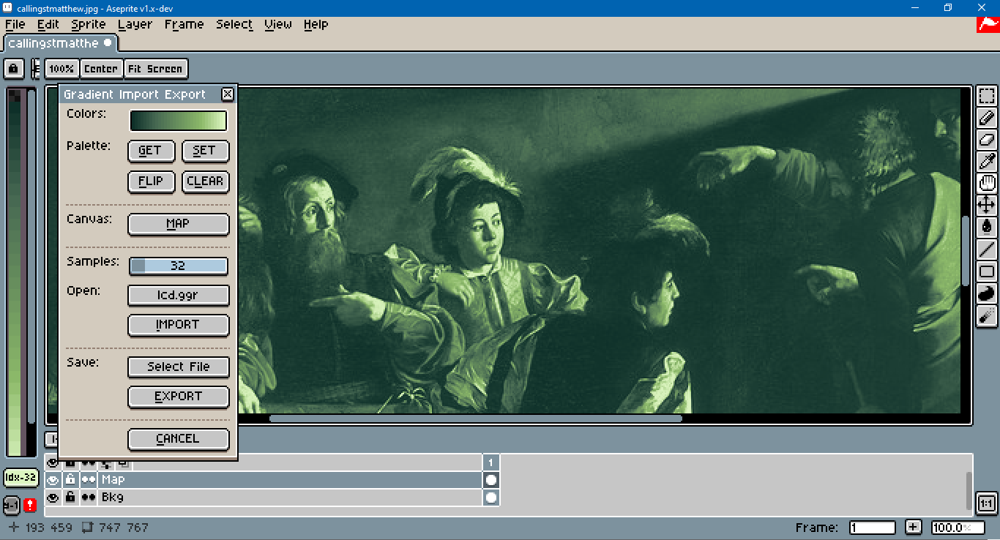

# Ase GGR IO

This is a `.ggr` import-export dialog for use with the [Aseprite](https://www.aseprite.org/) [scripting API](https://github.com/aseprite/api). `.ggr` is a file format for storing [GIMP](https://www.gimp.org/) gradients. The test image used above is [Caravaggio's Calling of St. Matthew](https://www.wikiwand.com/en/The_Calling_of_St_Matthew).

## Download

To download this script, click on the green Code button above, then select Download Zip. You can also click on the `gradientio.lua` file. Beware that some browsers will append a `.txt` file format extension to script files on download. Aseprite will not recognize the script until this is removed and the original `.lua` extension is used. There can also be issues with copying and pasting. Be sure to click on the Raw file button; do not copy the formatted code.

## Usage

To use this script, open Aseprite. In the menu bar, go to `File > Scripts > Open Scripts Folder`. Move the Lua script into the folder that opens. Return to Aseprite; go to `File > Scripts > Rescan Scripts Folder` (the default hotkey is `F5`). The script should now be listed under `File > Scripts`. Select `gradientio.lua` to launch the dialog.

If an error message in Aseprite's console appears, check if the script folder is on a file path that includes characters beyond [UTF-8](https://en.wikipedia.org/wiki/UTF-8), such as 'é' (e acute) or 'ö' (o umlaut).

A hot key can be assigned to the script by going to `Edit > Keyboard Shortcuts`. The search input box in the top left of the shortcuts dialog can be used to locate the script by its file name.

Upon launching the dialog, the import file widget will have focus. Holding down the `Alt` key and pressing `C` close the dialog. `Alt+G` will get colors from the palette; `Alt+S` will set the swatches to the palette; `Alt+F` will reverse, or flip, the palette, `Alt+L` will clear the dialog swatches. And so on.

The map button finds the [relative luminance](https://www.wikiwand.com/en/Relative_luminance) of each pixel in the active image, then provides that as a factor to the dialog's gradient swatches. A new layer is created for the mapped image. It does not work in grayscale mode. Nor does it work with reference and tile map layers. It assumes the [standard RGB](https://www.wikiwand.com/en/SRGB) color space.

Aseprite's UI has a bug where the swatches widget will not display a large number of color swatches correctly. The rightmost swatch will be larger than others. To mitigate this issue, try resizing the dialog horizontally.

## Issues

This script was tested in Aseprite version 1.2.40-x64 on Windows 10. Its user interface elements were tested with 100% screen scaling and 200% UI scaling.

Please report issues in the [Issues](https://github.com/behreajj/AseGgrIo/issues) section on Github. When reporting, please include the version of Aseprite used.